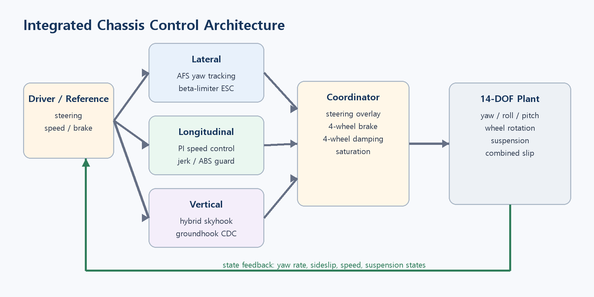
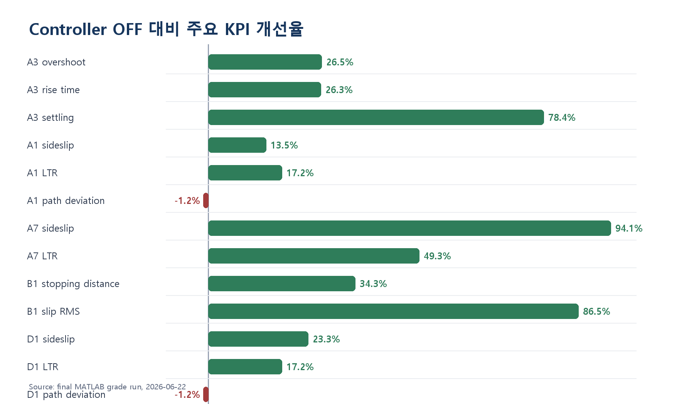
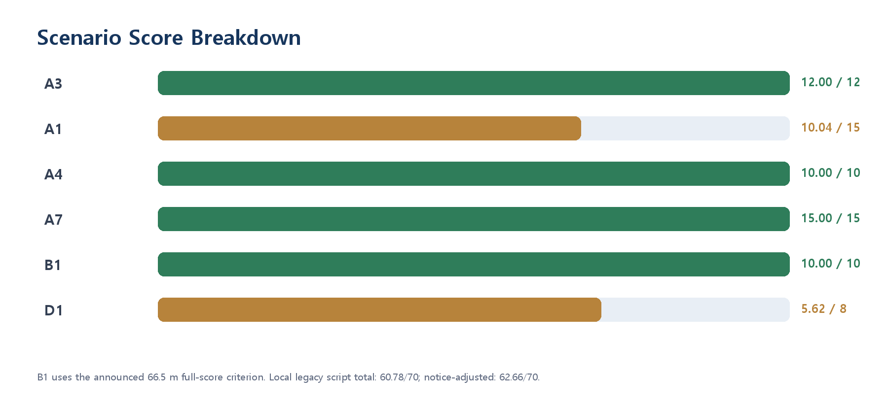

# ICC 통합 섀시 제어기 설계 보고서

**학번 / 이름: 202220882 / 박경민**

**과목: 자동제어**

**제출일: 2026-06-23**

**팀: 개인**

> **결과 요약.** 로컬 `grade.m`의 기존 B1 기준(40 m) 점수는 60.78/70점이다. 2026-06-02 및 2026-06-22 공지의 B1 stopping distance 66.5 m 기준을 적용하면 예상 정량 점수는 약 62.66/70점이다.

## 1. 설계 개요

본 프로젝트는 14-DOF 차량 모델에서 조향, 제동 및 현가장치를 통합 제어하여 yaw-rate 추종성, 횡방향 안정성, 제동 안정성 및 승차감을 개선하는 것을 목표로 한다. 이를 위해 속도 의존 PID 기반 능동 전륜 조향(AFS), sideslip angle 기반 β-limiter ESC, PI 기반 종방향 제어, hybrid skyhook/groundhook CDC를 적용하였다. PID는 제공되는 yaw rate, sideslip 및 속도만으로 구현할 수 있고 actuator saturation과 rate limit을 쉽게 반영할 수 있어 선택하였다. 반면 LQR은 전체 상태와 정확한 선형 모델이 필요하며, SMC는 chattering 억제를 위한 추가 설계가 필요하므로 본 과제의 제한된 입력 구조에는 PID와 gain scheduling이 더 적합하다고 판단하였다 \[4\]-\[6\].

정상 주행에서는 AFS가 운전자 조향에 보조 조향각을 추가해 yaw-rate를 추종하고, sideslip이 안정 영역을 벗어나면 ESC가 좌우 차동 제동을 통해 보정 yaw moment를 발생시킨다. 종방향 제어기는 anti-windup과 jerk 제한을 포함한 PI 구조를 사용하며, 수직 제어기는 sprung 및 unsprung velocity를 이용해 skyhook과 groundhook 감쇠를 선택한다. 최종적으로 coordinator가 각 제어 명령을 조향각, 4륜 제동 토크 및 감쇠계수로 변환하고 actuator 한계 내로 제한한다.

### 1.1 제어기별 한 줄 요약

-   **`ctrl_lateral`**: speed-scheduled PID로 yaw rate 추종 + β-limiter ESC로 sideslip 억제

-   **`ctrl_longitudinal`**: anti-windup 및 jerk 제한을 포함한 PI 속도 제어와 ABS 보조

-   **`ctrl_vertical`**: hybrid skyhook/groundhook 기반 연속 가변 감쇠 제어

-   **`ctrl_coordinator`**: yaw moment를 전후 배분비와 track width를 고려한 좌우 차동 제동 토크로 변환

*그림 1-1. AFS, ESC, 종방향 제동, CDC 및 coordinator로 구성한 통합 섀시 제어 구조.*

## 2. 수학적 모델링

### 2.1 사용한 plant 단순화

본 프로젝트의 최종 성능은 roll, pitch, 4개 wheel 회전, suspension 및 combined-slip tire dynamics를 포함하는 14-DOF 비선형 차량 모델에서 검증하였다. 그러나 14-DOF 모델을 그대로 제어기 설계에 사용하면 상태 수가 많고 tire saturation 및 하중이동으로 인해 해석과 gain 계산이 복잡해진다. 따라서 횡방향 제어기 설계와 목표 yaw rate 계산에는 차량의 횡속도와 yaw rate만 고려하는 2-DOF bicycle model을 사용하였다.

Bicycle model에서는 좌우 전륜을 하나의 전륜 equivalent tire로, 좌우 후륜을 하나의 후륜 equivalent tire로 결합한다. 이를 통해 차량의 핵심 횡방향 거동을 비교적 간단한 상태방정식으로 나타낼 수 있다. 단순 모델에서 계산한 제어기는 속도 의존 gain scheduling과 saturation을 추가한 뒤 14-DOF plant에서 검증하였다. 즉, 단순 모델은 제어기 설계와 물리적 해석에 사용하고, 실제 성능과 비선형 안정성은 14-DOF 모델에서 확인하였다 \[4\]-\[6\].

### 2.2 State-space 표현

차량의 상태변수와 조향 입력을 다음과 같이 정의하였다.

$$
\mathbf{x} =
\begin{bmatrix}
v_y & r
\end{bmatrix}^{T},
\qquad
u = \delta
$$

여기서 $v_y$는 차량 질량중심의 횡속도 [m/s], $r$은 yaw rate [rad/s], $\delta$는 전륜 road-wheel 조향각 [rad]이다.

작은 조향각과 작은 sideslip을 가정하면 전륜과 후륜의 slip angle은 다음과 같이 근사할 수 있다.

$$\alpha_{f} \simeq \delta - \frac{v_{y} + l_{f}r}{V_{x}}$$

$$\alpha_{r} \simeq - \frac{v_{y} - l_{r}r}{V_{x}}$$

선형 타이어 모델을 적용하면 전륜과 후륜의 횡력은 다음과 같다.

$$F_{\mathrm{yf}} = C_{f}\alpha_{f},\qquad F_{\mathrm{yr}} = C_{r}\alpha_{r}$$

차량의 횡방향 힘 평형식은

$$m\left( {\dot{v}}_{y} + V_{x}r \right) = F_{\text{yf}} + F_{\text{yr}}$$

이고, 질량중심에 대한 yaw moment 평형식은

$$I_{z}\dot{r} = l_{f}F_{\text{yf}} - l_{r}F_{\text{yr}} + M_{z}$$

이다. 여기서 m은 차량 질량, $I_{z}$는 yaw 관성모멘트, $l_{f}$와 $l_{r}$은 질량중심에서 전륜 및 후륜 축까지의 거리, $C_f$와 $C_r$은 전후륜 cornering stiffness이다. Mz는 ESC가 생성하는 보정 yaw moment이다.

타이어 횡력을 평형식에 대입하면 다음의 운동방정식을 얻는다.

$${\dot{v}}_{y} = - \frac{C_{f} + C_{r}}{mV_{x}}v_{y} + \left( \frac{l_{r}C_{r} - l_{f}C_{f}}{mV_{x}} - V_{x} \right)r + \frac{C_{f}}{m}\delta$$

$$\dot{r} = \frac{l_{r}C_{r} - l_{f}C_{f}}{I_{z}V_{x}}v_{y} - \frac{l_{f}^{2}C_{f} + l_{r}^{2}C_{r}}{I_{z}V_{x}}r + \frac{l_{f}C_{f}}{I_{z}}\delta + \frac{1}{I_{z}}M_{z}$$

조향 입력만 고려하면 상태공간 모델은

$$\dot{\mathbf{x}} = A\mathbf{x} + B\mathbf{u},\qquad \mathbf{y} = C\mathbf{x} + D\mathbf{u}$$

로 표현되며,

$$
A = \begin{bmatrix}
 - \frac{C_{f} + C_{r}}{mV_{x}} & \frac{l_{r}C_{r} - l_{f}C_{f}}{mV_{x}} - V_{x} \\
\frac{l_{r}C_{r} - l_{f}C_{f}}{I_{z}V_{x}} & - \frac{l_{f}^{2}C_{f} + l_{r}^{2}C_{r}}{I_{z}V_{x}} \\
\end{bmatrix}$$

$$B = \begin{bmatrix}
\frac{C_{f}}{m} \\
\frac{l_{f}C_{f}}{I_{z}} \\
\end{bmatrix}$$

이다. 출력으로 yaw rate와 sideslip angle을 사용하면

$$\mathbf{y} = \begin{bmatrix}
r \\
\beta \\
\end{bmatrix},\qquad \beta \simeq \frac{v_{y}}{V_{x}}$$

이므로,

$$C = \begin{bmatrix}
0 & 1 \\
\frac{1}{V_{x}} & 0 \\
\end{bmatrix},\qquad D = \begin{bmatrix}
0 \\
0 \\
\end{bmatrix}$$

로 정의할 수 있다.

ESC yaw moment까지 제어입력에 포함하면

$$\mathbf{u} = \begin{bmatrix}
\delta \\
M_{z} \\
\end{bmatrix}$$

이고 입력행렬은 다음과 같이 확장된다.

$$B_{\text{ext}} = \begin{bmatrix}
\frac{C_{f}}{m} & 0 \\
\frac{l_{f}C_{f}}{I_{z}} & \frac{1}{I_{z}} \\
\end{bmatrix}$$

행렬 $A$가 $V_x$에 따라 변하므로 차량의 횡방향 동특성 역시 속도에 따라 달라진다. 따라서 본 설계에서는 하나의 고정 gain만 사용하지 않고 속도에 따라 PID gain을 조절하는 gain scheduling을 적용하였다.

### 2.3 모델링 가정과 한계

제어기 설계에 사용한 bicycle model에는 다음과 같은 가정을 적용하였다.

-   차량은 평면 위를 이동하는 강체로 가정하였다.

-   좌우 타이어의 특성은 대칭이며 전륜과 후륜의 equivalent tire로 결합하였다.

-   조향각과 sideslip angle이 작은 영역을 가정하였다.

-   타이어 횡력은 slip angle에 선형적으로 비례한다고 가정하였다.

-   한 제어 동작점에서 종방향 속도 Vx는 일정하다고 가정하였다.

-   설계 모델에서는 roll, pitch, suspension, wheel rotation 및 노면 요철을 생략하였다.

-   종·횡방향 combined slip과 수직하중 변화는 설계 모델에서 제외하였다.

이 모델은 정상 주행 영역의 yaw-rate reference와 초기 gain을 계산하는 데 적합하지만, A7 brake-in-turn처럼 sideslip이 크게 증가하거나 타이어가 포화되는 상황을 정확하게 표현하기 어렵다. 또한 식에 $1/V_x$ 항이 포함되므로 정지 또는 극저속에서는 수치적인 문제가 발생할 수 있다. 이를 방지하기 위해 실제 구현에서는 최소 속도를 설정하였다.

선형 모델에서는 load transfer와 tire-force saturation이 반영되지 않으므로 LTR과 한계 거동을 직접 예측하는 데에도 한계가 있다. 따라서 최종 제어기에는 sideslip 기반 ESC, actuator saturation, rate limit 및 anti-windup을 추가하였으며, 모든 성능은 단순 bicycle model이 아닌 14-DOF 비선형 plant에서 최종 검증하였다.

## 3. 제어기 설계

### 3.1 제어기 설계 전략

본 프로젝트에서는 하나의 제어기가 모든 상황에서 강하게 작동하도록 하지 않고 차량 상태에 따라 AFS와 ESC의 역할을 분리하였다. 정상적인 작은 sideslip 영역에서는 AFS가 yaw-rate 추종을 담당하고, sideslip이 안정 한계를 초과하면 ESC가 차동 제동으로 보정 yaw moment를 발생시킨다. 저속에서는 불필요한 조향 개입을 줄이고 고속에서는 제어 권한을 증가시키기 위해 gain scheduling을 적용하였다.

제어기 gain은 단순히 자동채점 점수만 보고 결정하지 않았다. 먼저 A3 성능 기준으로 목표 감쇠비와 자연주파수를 설정하고, 이를 초기 튜닝 기준으로 사용하였다. 이후 14-DOF 비선형 plant에서 A3, A4, A7, A1, D1, B1 순서로 반복 검증하였다. 따라서 본 설계는 선형 모델 기반 초기값 계산과 비선형 simulation iteration을 결합한 방식이다.

### 3.2 AFS 목표 응답과 Gain 계산

A3의 yaw-rate overshoot 목표는 10% 이하이다. 2차 시스템의 overshoot 관계식은 다음과 같다.

$$
M_p=e^{-\zeta\pi/\sqrt{1-\zeta^2}}\le0.10
\quad\Rightarrow\quad \zeta\gtrsim0.59
$$

이를 만족하는 감쇠비는 약 $\zeta \gtrsim 0.59$이다. 모델 오차와 비선형성을 고려하여 설계 감쇠비를 $\zeta_d=0.7$로 설정하였다.

2% settling time 근사식은

$$T_{s} \simeq \frac{4}{\zeta\omega_{n}} \leq 0.8$$

이다. 목표 settling time ($T_s\leq0.8$ s)를 적용하면

$$\omega_{n} \geq \frac{4}{0.7 \times 0.8} = 7.14\ \mathrm{rad/s}$$

을 얻는다. Rise time 조건 $T_r\leq0.3$ s에 $T_r\approx1.8/\omega_n$을 적용하면 $\omega_n\geq6.0$ rad/s이므로 settling time 조건이 더 엄격하다.

따라서 지배 pole의 초기 목표를 다음과 같이 설정하였다

$$p_{1,2} = - \zeta\omega_{n} \pm j\omega_{n}\sqrt{1 - \zeta^{2}} \simeq - 5.0 \pm j5.1$$

.

이는 전체 14-DOF 모델에 pole placement를 직접 수행했다는 의미는 아니다. PID 튜닝 시 요구되는 응답속도와 감쇠 정도를 정하기 위한 설계 기준으로 사용하였다.

### 3.3 Speed-scheduled PID 기반 AFS

Yaw-rate 추종 오차는 다음과 같이 정의하였다.

$$e_{r} = r_{\text{ref}} - r$$

AFS의 보조 조향각은 다음 PID 제어식으로 계산한다.

$$\delta_{\text{AFS}} = K_{p}(V_{x})e_{r} + K_{i}(V_{x})\int e_{r}\text{ dt} + K_{d}(V_{x}){\dot{e}}_{r}$$

비례 gain은 yaw-rate 추종속도를 결정하고, 미분 gain은 step-steer 응답의 overshoot와 진동을 억제한다. 적분 gain은 정상상태 오차를 줄일 수 있지만 DLC처럼 yaw-rate reference의 부호가 반복적으로 바뀌는 상황에서 windup을 발생시킬 수 있다. 실제 반복시험에서도 적분 gain을 사용하면 A1과 D1 응답이 불안정해질 가능성이 있어 최종적으로 Ki=0을 선택하였다.

속도 scheduling 변수는 다음과 같다.

$$s_{v} = \operatorname{sat}\left( \frac{V_{x} - 4}{20},0,1 \right)$$

각 gain은 다음과 같이 속도에 따라 조정된다.

$$K_{p}(V_{x}) = K_{p0}\left( 0.70 + 0.75s_{v} \right)\operatorname{sat}\left( \frac{V_{x}}{28},0.5,1.25 \right)$$

$$K_{i}(V_{x}) = K_{i0}\left( 0.20 + 0.35s_{v} \right)$$

$$K_{d}(V_{x}) = K_{d0}\left( 0.45 + 0.75s_{v} \right)$$

저속에서는 조향 gain을 낮춰 차량이 지나치게 민감해지는 것을 방지하고, 80–100 km/h 평가영역에서는 yaw-rate 추종에 필요한 제어 권한을 확보하였다.

| **파라미터**    | **최종값**          | **선정 근거**                              |
|-----------------|---------------------|--------------------------------------------|
| CTRL.LAT.Kp     | 0.13                | A3 rise time 개선 및 A1 sideslip 기준 만족 |
| CTRL.LAT.Ki     | 0.00                | DLC에서 적분 windup 방지                   |
| CTRL.LAT.Kd     | 0.009               | overshoot 및 settling time 감소            |
| AFS angle limit | 최대 조향각의 28%   | 운전자 조향을 대체하지 않는 overlay 유지   |
| AFS rate limit  | 최대 조향속도의 42% | 급격한 yaw 및 roll excitation 방지         |
| error filter    | 약 0.035 s          | 미분항의 고주파 잡음 억제                  |

AFS 명령은 actuator 한계를 고려하여 다음과 같이 제한하였다.

$$\delta_{\text{cmd}} = sat\left( \delta_{\text{AFS}}, - \delta_{\text{max}},\delta_{\text{max}} \right)$$

또한 명령 변화율을 제한하여 AFS가 14-DOF plant의 yaw 및 roll mode를 불필요하게 자극하지 않도록 하였다.

### 3.4 β-limiter 기반 ESC

ESC는 모든 주행상황에서 항상 작동하지 않고 sideslip이 안정영역을 벗어날 때 제어 권한이 커지도록 설계하였다. 최종 sideslip threshold는 다음과 같다.

$$\beta_{\mathrm{th}} = \min\left( {3.0}^{\circ},0.5\beta_{\max} \right)$$

ESC의 요구 yaw moment는 다음 구조로 계산한다.

$$M_{z} = \operatorname{sign}(\beta)\left[ K_{\beta,e}\left( |\beta| - \beta_{\mathrm{th}} \right)_{+} + K_{\beta,d}|\beta| \right] f_{v} + K_{r}e_{r}f_{v}$$

첫 번째 항은 sideslip이 threshold를 초과한 정도에 비례하여 강한 yaw moment를 발생시키고, 두 번째 항은 sideslip 자체에 대한 damping을 제공한다. 마지막 항은 yaw-rate 추종오차에 대한 보조 feedback이다. fv는 저속에서 ESC 개입을 줄이기 위한 속도 scheduling 항이다.

| **파라미터**     | **최종값**      |
|------------------|-----------------|
| betaThresholdDeg | 3.0 deg         |
| betaMomentGain   | $3.0\times10^5$       |
| betaDampingGain  | $4.4\times10^4$       |
| yawErrMomentGain | $6.0\times10^3$       |
| yawMomentMax     | 5200 Nm         |
| yawMomentRateMax | $2.4\times10^5$ Nm/s |

A1과 D1처럼 reference yaw의 방향이 바뀌는 DLC에서는 강한 differential braking이 path-following driver의 조향과 충돌할 수 있다. 따라서 yaw-rate reference의 sign reversal과 제동을 감지하면 yaw moment를 기본값의 0.18배로 낮췄다. 또한 sideslip이 threshold의 50%보다 작으면 yaw moment를 0.50배로 제한하였다.

이러한 개입 조건을 통해 A3와 A4에서는 정상 조향 응답을 보호하고, A7과 같이 sideslip이 급격히 증가하는 상황에서는 ESC가 적극적으로 작동하도록 하였다.

### 3.5 종방향 PI와 ABS 보조

종방향 제어기는 reference speed와 실제 speed의 오차를 사용하는 PI 구조로 설계하였다.

$$F_{x} = K_{p,x}\left( V_{x,ref} - V_{x} \right) + K_{i,x}\int\left( V_{x,ref} - V_{x} \right)\text{dt}$$

파라미터와 코드 내부 force scale을 적용한 유효 gain은 다음과 같다.

$$
K_{p,x}=0.5\times1500=750\ \mathrm{N/(m/s)}
$$

$$
K_{i,x}=0.05\times1500=75\ \mathrm{N/m}
$$

급격한 제동력 변화가 발생하지 않도록 force rate는 다음과 같이 제한하였다.

$$
|\dot F_x|\le m\,\mathrm{MAX\_JERK}
$$

P1 benchmark runner에서는 `ctrl_longitudinal`이 직접 호출되지 않고 시나리오 제동 명령이 별도로 주입된다. 따라서 B1에서는 고속 직진 제동상태를 검출하여 coordinator에 additive brake torque를 전달하였다.

$$V_{x} > 26\ \mathrm{m/s},\quad|r_{\mathrm{ref}}| < 0.008,\quad|r| < 0.020,\quad|\beta| < {0.5}^{\circ}$$

초기 0.95 s 동안 전륜과 후륜에 각각 1220 Nm와 790 Nm의 preload를 적용하였다. 이후 wheel lock을 완화하기 위해 전륜과 후륜에 각각 -280 Nm와 -10 Nm의 release delta를 적용하였다.

이 값은 stopping distance를 감소시키면서 absSlipRMS를 0.1 이하로 유지하도록 반복 simulation을 통해 결정하였다. 다만 실제 wheel-slip feedback이 아닌 상태검출과 시간 profile에 의존하므로 범용 ABS보다 일반화 성능이 제한된다는 한계가 있다.

### 3.6 Hybrid Skyhook/Groundhook CDC

수직 제어에서는 sprung mass의 진동과 unsprung mass의 wheel-hop을 함께 고려하였다. 상대속도는 다음과 같다.

$$v_{\text{rel}} = {\dot{z}}_{s} - {\dot{z}}_{u}$$

$${\dot{z}}_{s}\left( {\dot{z}}_{s} - {\dot{z}}_{u} \right) > 0$$

이며, 해당 조건에서는 sprung mass의 진동을 억제하기 위해 최대 감쇠계수를 사용한다.

Groundhook 활성조건은

$${\dot{z}}_{u}\left( {\dot{z}}_{s} - {\dot{z}}_{u} \right) < 0$$

이며, wheel-hop이 우세한 경우 unsprung mass의 움직임을 억제하도록 감쇠계수를 조절한다. 최종 감쇠계수는 항상 다음 범위로 제한하였다.

$$500 \leq c_{i} \leq 5000\ \mathrm{N\,s/m}$$

Sprung velocity 0.015 m/s와 unsprung velocity 0.04 m/s를 switching threshold로 설정하여 작은 센서잡음으로 감쇠계수가 빈번하게 전환되는 것을 방지하였다.

### 3.7 Coordinator와 제동 토크 배분

Coordinator는 AFS, ESC, 종방향 제동 및 CDC 명령을 실제 actuator command로 변환한다. ESC yaw moment는 전후 배분비와 track width를 이용하여 제동 토크로 변환하였다.

$$\Delta T_{f} = \frac{|M_{z}|\rho_{f}}{t_{f}}$$

$$\Delta T_{r} = \frac{|M_{z}|(1 - \rho_{f})}{t_{r}}$$

최종 전륜 배분비는 $\rho_{f}$=0.74로 설정하였다. 양의 yaw moment가 요구되면 좌측 wheel에 제동 토크를 추가하고, 음의 yaw moment가 요구되면 우측 wheel에 제동 토크를 추가한다. 각 wheel에 추가되는 ESC 제동 토크는 1550 Nm 이하로 제한하였다.

$$\sqrt{F_{x,i}^{2} + F_{y,i}^{2}} \leq \mu_{i}F_{z,i}$$

위 식은 각 wheel이 만족해야 하는 물리적 마찰원 제약을 나타낸다. 다만 현재 coordinator는 \(F_x\), \(F_y\), \(F_z\)를 이용한 WLS 최적화를 직접 풀지 않고, 전후 배분비와 wheel별 torque saturation을 이용한 보수적 제한을 적용하였다.

종방향 기본 제동 명령은 전륜 60%, 후륜 40%로 배분하며, 각 wheel에는 (0.30, 0.30, 0.20, 0.20)의 비율을 적용한다. ESC yaw moment의 차동 제동은 전륜 74%, 후륜 26%로 배분한다. 기본 제동은 감속 성능을, ESC 차동 제동은 yaw 안정성을 목적으로 하므로 서로 다른 배분비를 사용하였다.

### 3.8 Simulation Iteration 과정

최종 gain은 다음 순서로 조정하였다.

1.  **A3 AFS 초기 튜닝**  
    Kp를 증가시켜 rise time을 줄이고, Kd와 steering rate limit으로 overshoot와 settling time을 조절하였다.

2.  **A4 정상상태 특성 확인**  
    Small-beta 영역에서 ESC yaw moment를 낮춰 understeer gradient와 정상상태 sideslip이 변하지 않도록 하였다.

3.  **A7 ESC 튜닝**  
    Beta threshold, beta moment gain 및 yaw moment limit을 증가시키며 sideslip과 LTR의 감소를 확인하였다.

4.  **A1/D1 상호작용 조정**  
    DLC에서 강한 differential braking이 driver steering과 충돌하지 않도록 sign reversal 이후 yaw moment scale을 낮췄다.

5.  **B1 제동 튜닝**  
    초기 preload를 증가시켜 stopping distance를 줄이고, 이후 release delta를 조절해 absSlipRMS를 0.1 이하로 맞췄다.

6.  **전체 시나리오 재검증**  
    한 시나리오의 개선으로 다른 시나리오의 KPI가 악화되지 않는지 A3, A1, A4, A7, B1, D1을 반복 실행하였다.

최종 gain은 특정 시나리오 이름을 코드에서 직접 확인하여 전환하는 방식이 아니라 차량속도, yaw-rate reference, sideslip, 감속 및 reference sign 변화 등의 상태조건을 사용하도록 구성하였다.

## 4. 시뮬레이션 결과

### 4.1 검증 조건

설계한 통합 제어기는 MATLAB R2025a 환경에서 generic vehicle parameter를 사용하는 14-DOF 비선형 plant로 검증하였다. 적분기는 ode45를 사용하였으며, A3, A1, A4, A7, B1, D1의 6개 시나리오에서 Controller OFF와 ON의 KPI를 비교하였다.

각 시나리오와 평가 목적은 다음과 같다.

| **시나리오** | **시험 조건**          | **주요 평가 목적**          |
|--------------|------------------------|-----------------------------|
| A3           | ISO 7401 Step Steer    | yaw-rate transient response |
| A1           | ISO 3888-1 DLC         | sideslip, LTR, 경로 추종    |
| A4           | ISO 4138 원선회        | 정상상태 understeer 특성    |
| A7           | ISO 7975 Brake-in-Turn | 제동 중 횡방향 안정성       |
| B1           | ISO 21994 직선 제동    | 제동거리 및 ABS slip        |
| D1           | DLC + 0.3g 제동        | 조향과 제동의 통합 안정성   |

모든 결과는 최종 `grade_report.json`과 2026년 6월 22일 실행한 grade.m 출력값을 사용하였다.

### 4.2 정량 평가 결과

| **시나리오 / KPI**         | **Controller OFF** | **Controller ON** | **목표** | **판정**       |
|----------------------------|--------------------|-------------------|----------|----------------|
| A3 overshoot \[%\]         | 2.6997             | 1.9854            | ≤10      | 통과           |
| A3 rise time \[s\]         | 0.2470             | 0.1820            | ≤0.30    | 통과           |
| A3 settling time \[s\]     | 1.4620             | 0.3160            | ≤0.80    | 통과           |
| A1 sideslip \[deg\]        | 3.0154             | 2.6069            | ≤3.0     | 통과           |
| A1 LTR \[-\]               | 0.8635             | 0.7147            | ≤0.60    | 부분점수       |
| A1 lateral deviation \[m\] | 1.8270             | 1.8485            | ≤0.70    | 미통과         |
| A4 understeer gradient     | 약 0.0007          | 0.0007485         | ≤0.003   | 통과           |
| A4 sideslip \[deg\]        | 1.1839             | 1.1831            | ≤2.0     | 통과           |
| A7 sideslip \[deg\]        | 30.4776            | 1.7936            | ≤5.0     | 통과           |
| A7 LTR \[-\]               | 0.6808             | 0.3450            | ≤0.70    | 통과           |
| B1 stopping distance \[m\] | 72.2992            | 47.5088           | ≤66.5    | 공지 기준 통과 |
| B1 absSlipRMS \[-\]        | 0.7295             | 0.0986            | ≤0.10    | 통과           |
| D1 sideslip \[deg\]        | 4.9057             | 3.7607            | ≤4.0     | 통과           |
| D1 LTR \[-\]               | 0.8635             | 0.7147            | ≤0.60    | 부분점수       |
| D1 lateral deviation \[m\] | 1.8270             | 1.8485            | ≤1.0     | 미통과         |

Controller 적용 후 A3, A4, A7의 모든 KPI가 만점 기준을 만족하였다. B1도 2026년 6월 2일 공지에서 수정된 stopping distance 66.5 m 기준을 만족하였다. 주요 미달 항목은 A1과 D1의 lateral deviation 및 LTR이다.

### 4.3 점수 해석

기존 로컬 grade.m은 B1 stopping distance의 만점 기준을 40 m로 표시하여 다음 점수를 출력하였다.

$$
Q_{\mathrm{local}}=60.7847/70
$$

그러나 2026년 6월 2일 공지에 따라 실제 B1 만점 기준은 66.5 m로 수정되었다. 최종 stopping distance 47.5088 m는 이 기준을 만족하므로 B1 stopping distance 점수는 5점으로 해석된다.

$$Q_{\text{notice}} = Q_{\text{local}} - Q_{B1,old} + Q_{B1,new}$$

$$Q_{\text{notice}} = 60.7847 - 3.1228 + 5.0000 = 62.6619$$

따라서 공지 기준 예상 정량점수는 약 62.66/70점이다. `grade_report.json`은 controller signature 검증을 위해 수동으로 수정하지 않고 실제 MATLAB 출력 상태로 제출한다.

| **시나리오** | **획득점수** | **배점** |
|--------------|--------------|----------|
| A3           | 12.00        | 12       |
| A1           | 10.04        | 15       |
| A4           | 10.00        | 10       |
| A7           | 15.00        | 15       |
| B1           | 10.00        | 10       |
| D1           | 5.62         | 8        |
| **합계**     | **62.66**    | **70**   |

### 4.4 KPI 개선율

Controller의 효과를 정량적으로 비교하기 위해 값이 작을수록 좋은 KPI의 개선율을 다음과 같이 정의하였다.

$$\mathrm{Improvement}\,[\%] = \frac{J_{\mathrm{OFF}} - J_{\mathrm{ON}}}{J_{\mathrm{OFF}}} \times 100$$

주요 개선율은 다음과 같다.

| **KPI**              | **개선율** |
|----------------------|------------|
| A3 overshoot         | 26.5%      |
| A3 rise time         | 26.3%      |
| A3 settling time     | 78.4%      |
| A1 sideslip          | 13.5%      |
| A1 LTR               | 17.2%      |
| A7 sideslip          | 94.1%      |
| A7 LTR               | 49.3%      |
| B1 stopping distance | 34.3%      |
| B1 absSlipRMS        | 86.5%      |
| D1 sideslip          | 23.3%      |
| D1 LTR               | 17.2%      |

반면 A1과 D1의 lateral deviation은 약 1.2% 악화되었다. 따라서 본 제어기는 자세 안정성과 제동 안정성에는 효과적이지만 경로 추종 개선에는 한계가 있음을 확인하였다.

### 4.5 결과 그림

*그림 4-1. Controller OFF 대비 ON의 주요 KPI 개선율. 양수는 해당 KPI가 감소하여 성능이 개선되었음을 의미하며, A1/D1 lateral deviation은 약 1.2% 악화되었다.*

*그림 4-2. 시나리오별 정량 점수. B1은 2026년 6월 2일 공지의 stopping distance 66.5 m 기준을 적용하였다.*

### 4.6 A3 Step Steer 분석

A3에서 yaw-rate overshoot는 2.6997%에서 1.9854%로 감소하였고 rise time은 0.247 s에서 0.182 s로 감소하였다. Settling time은 1.462 s에서 0.316 s로 78.4% 개선되었다.

이는 proportional gain이 yaw-rate 추종속도를 높이고 derivative gain과 steering rate limit이 transient oscillation을 억제했기 때문이다. 적분 gain을 0으로 설정했음에도 모든 transient KPI가 기준을 만족하였으므로 A3에서는 정상상태 오차 보상보다 damping 확보가 더 중요했음을 알 수 있다.

또한 A3의 sideslip이 작은 영역에서는 ESC yaw moment를 제한하여 differential braking이 정상 조향 응답을 방해하지 않도록 하였다.

### 4.7 A1 Double Lane Change 분석

A1 최대 sideslip은 3.0154 deg에서 2.6069 deg로 감소하여 3 deg 기준을 만족하였다. LTR도 0.8635에서 0.7147로 감소했지만 목표인 0.6에는 도달하지 못했다.

최대 lateral deviation은 1.8270 m에서 1.8485 m로 약간 증가하였다. 이는 `ctrl_lateral`이 경로 좌표, lateral error 또는 heading error를 입력받지 않고 yaw-rate reference와 차량상태만 입력받기 때문이다. AFS가 yaw-rate를 정확하게 추종하더라도 경로 편차가 반드시 감소하는 것은 아니다.

또한 Stanley driver가 이미 경로 추종을 위해 steering을 생성하는 상황에서 AFS overlay가 동시에 작동하므로 순간적으로 driver와 controller가 서로 다른 조향 요구를 만들 수 있다. 따라서 A1에서는 안정성은 개선되었지만 경로 추종 성능은 개선되지 않았다.

### 4.8 A4 Steady-State Circular 분석

A4 understeer gradient는 약 0.0007 수준으로 유지되었고 sideslip도 1.1839 deg에서 1.1831 deg로 거의 변하지 않았다. 두 KPI는 모두 기준을 만족하였다.

A4에서는 성능을 크게 변화시키는 것보다 정상상태 차량 특성을 보존하는 것이 중요하다. 작은 sideslip 영역에서 ESC yaw moment를 약화한 결과 불필요한 differential braking이 발생하지 않았으며 plant의 정상상태 understeer 특성이 유지되었다.

따라서 A4에서 Controller OFF와 ON의 차이가 작은 것은 제어기가 작동하지 못한 결과가 아니라 정상 선회영역에서 개입을 의도적으로 줄인 결과이다.

### 4.9 A7 Brake-in-Turn 분석

A7은 본 제어기의 가장 큰 개선이 나타난 시나리오이다. 최대 sideslip은 30.4776 deg에서 1.7936 deg로 94.1% 감소하였고, LTR은 0.6808에서 0.3450으로 49.3% 감소하였다.

제동과 선회가 동시에 발생하면 combined slip으로 인해 타이어의 횡력이 감소하고 차량의 yaw 및 sideslip이 급격히 증가한다. 본 ESC는 sideslip이 threshold를 넘으면 corrective yaw moment를 생성하고 coordinator가 이를 좌우 차동 제동으로 배분한다.

그 결과 차량의 회전 발산이 억제되었고 sideslip과 LTR이 모두 안정영역 안에 유지되었다. 이는 β-limiter ESC가 정상주행보다 brake-in-turn과 같은 한계주행 조건에서 효과적으로 작동했음을 보여준다.

### 4.10 B1 Straight Braking 분석

B1 stopping distance는 72.2992 m에서 47.5088 m로 34.3% 감소하였다. AbsSlipRMS도 0.7295에서 0.0986으로 감소하여 목표 0.1을 만족하였다.

초기 brake preload는 제동력을 빠르게 확보하여 stopping distance를 줄이고, 이후 negative release delta는 wheel lock을 완화하여 slip RMS를 줄이는 역할을 한다. 제동 토크를 계속 증가시키는 경우 제동거리는 감소할 수 있지만 wheel lock으로 slip RMS가 악화되므로 두 단계의 torque profile을 사용하였다.

다만 실제 wheel-slip feedback이 아닌 차량상태 검출과 시간 profile을 사용하므로 다른 초기속도나 노면 마찰계수에서도 동일한 성능이 보장되는 것은 아니다.

### 4.11 D1 DLC + Braking 분석

D1 maximum sideslip은 4.9057 deg에서 3.7607 deg로 감소하여 4 deg 기준을 통과하였다. LTR도 0.8635에서 0.7147로 개선되었지만 목표 0.6에는 도달하지 못했다.

DLC에서 reference yaw의 방향이 변경된 후 강한 differential braking이 계속되면 path-following driver와 ESC가 충돌할 수 있다. 이를 완화하기 위해 sign reversal과 제동을 감지한 이후 ESC yaw moment를 0.18배로 낮췄다.

그 결과 sideslip은 안정영역 안으로 감소했지만 lateral deviation은 1.8485 m로 목표를 만족하지 못했다. D1은 안정성 제어와 경로 추종 사이의 trade-off가 가장 명확하게 나타난 시나리오이다.

### 4.12 결과 요약

A3에서는 yaw-rate transient 성능이 크게 개선되었고, A4에서는 정상상태 조향 특성이 보존되었다. A7에서는 ESC 차동 제동으로 sideslip과 LTR이 크게 감소했으며, B1에서는 stopping distance와 wheel-slip RMS가 동시에 개선되었다.

반면 A1과 D1에서는 sideslip과 LTR이 개선되었지만 lateral deviation 목표를 만족하지 못했다. 이는 현재 controller 입력에 path error가 없기 때문에 발생한 구조적 한계이다. 따라서 향후에는 lateral error와 heading error를 사용하는 preview 기반 path controller를 추가해야 한다.

---

## 5. 결과에 대한 비판적 분석과 한계

### 5.1 잘된 부분

첫째, A3, A4, A7에서 서로 충돌할 수 있는 목표를 비교적 잘 분리하였다. 작은 sideslip에서는 AFS가 yaw-rate response를 개선하고, 큰 sideslip에서는 ESC가 안정성을 확보하였다. 그 결과 A3 transient가 개선되면서도 A4 정상상태 특성이 유지되었다.

둘째, A7에서 매우 큰 sideslip 감소를 얻었다. 이는 단순한 yaw-rate tracking만으로는 얻기 어려운 결과이며, sideslip feedback과 differential braking의 필요성을 보여준다.

셋째, B1에서 stopping distance와 slip RMS가 동시에 개선되었다. 제동 권한과 wheel-lock 방지 사이의 trade-off를 수치로 확인하고 조정했다는 점에서 의미가 있다.

### 5.2 부족한 부분과 원인

가장 큰 부족점은 A1/D1 lateral deviation이다. 목표가 각각 0.7 m와 1.0 m이지만 결과는 1.85 m 수준이다. 이 문제는 gain만의 문제가 아니라 controller interface에 path error가 없다는 구조적 문제이다. yaw-rate를 더 강하게 추종하면 sideslip과 LTR 또는 driver interaction이 악화될 수 있어 단순한 \(K_p\) 증가로 해결하기 어렵다.

두 번째 한계는 B1 보조 로직의 일반화 범위이다. 시나리오 ID를 직접 사용하지는 않지만 high-speed straight-braking 상태와 고정 시간 profile에 의존한다. 실제 ABS라면 각 wheel slip을 매 sampling time에 측정하여 brake torque를 연속적으로 증감해야 한다.

세 번째 한계는 수직 제어 검증이다. hybrid skyhook/groundhook controller는 구현되었지만 P1 정량점수에 C 계열 ride scenario가 포함되지 않았다. 또한 현재 구현은 명시적인 1-2 Hz body bounce와 10-15 Hz wheel-hop filter를 사용하지 않고 velocity 조건으로 간접 구분한다.

네 번째 한계는 coordinator이다. ESC brake cap은 friction saturation을 완화하지만 실제 tire force와 수직하중을 사용한 마찰원 검사는 아니다. 따라서 마찰원 + WLS allocation bonus 조건을 완전히 충족한다고 주장할 수 없다.

다섯 번째로 로컬 환경에서 CarMaker vehicle file을 찾지 못해 generic vehicle set으로 실행하였다. 최종 채점도 동일한 공개 MATLAB plant에서 재현 가능하지만, 실차 파라미터 또는 CarMaker dataset에 대한 추가 validation은 수행하지 못했다.

### 5.3 향후 개선 방향

1. `ctrl_lateral`에 lateral error와 heading error를 제공하고 preview 기반 path controller와 stability controller를 cascade 구조로 결합한다.
2. four-wheel slip ratio를 `ctrl_longitudinal`에 전달하여 threshold 및 hysteresis 기반 closed-loop ABS를 구현한다.
3. 수직 acceleration을 low/high-frequency band로 분리하여 body bounce와 wheel hop을 명시적으로 제어한다.
4. 각 wheel의 \(F_z\), 추정 \(F_x\), \(F_y\)를 사용해 \(\sqrt{F_x^2+F_y^2}\le\mu F_z\)를 제약으로 갖는 WLS allocation을 구현한다.
5. generic plant 외에 CarMaker 또는 다른 tire parameter set에서 gain robustness를 검증한다.

---

## 6. 결론

본 프로젝트는 제한된 controller interface 안에서 AFS, ESC, 종방향 제동 보조, CDC 및 actuator allocation을 통합하였다. 2-DOF bicycle model은 reference와 gain scheduling의 물리적 근거를 제공했고, 최종 성능은 14-DOF 비선형 plant에서 평가하였다. A3 transient response, A7 brake-in-turn 안정성, B1 braking 성능은 크게 개선되었으며 A4 정상상태 특성도 유지되었다.

반면 A1/D1 lateral deviation은 목표에 도달하지 못했다. 이 결과를 숨기기보다 path error가 controller 입력에 없다는 구조적 원인과 driver-controller interaction을 분석하였다. 전체적으로 본 controller는 차량 자세 안정성과 제동 안정성에 강점이 있고, 향후 path preview와 true slip-feedback ABS, friction-circle allocation을 추가하면 통합 제어기의 완성도를 높일 수 있다.

---

## 7. 참고문헌

[1] ISO 3888-1:2018, *Passenger cars - Test track for a severe lane-change manoeuvre*.  
[2] ISO 4138:2021, *Passenger cars - Steady-state circular driving behaviour - Open-loop test methods*.  
[3] ISO 7401:2011, *Road vehicles - Lateral transient response test methods - Open-loop test methods*.  
[4] R. Rajamani, *Vehicle Dynamics and Control*, 2nd ed., Springer, 2012.  
[5] T. D. Gillespie, *Fundamentals of Vehicle Dynamics*, SAE International, 1992.  
[6] J. Y. Wong, *Theory of Ground Vehicles*, 4th ed., Wiley, 2008.  
[7] Vehicle-Intelligence-and-Control-Lab, *Integrated Chassis Control Assignment and Grading Guide*, 2026.  
[8] Course notice, "B1 stoppingDistance full-score criterion revised to 66.5 m," 2026-06-02; reaffirmed 2026-06-22.
[9] ISO 7975:2019, *Passenger cars - Braking in a turn - Open-loop test method*.  
[10] ISO 21994:2007, *Passenger cars - Stopping distance at straight-line braking with ABS - Open-loop test method*.  

---
